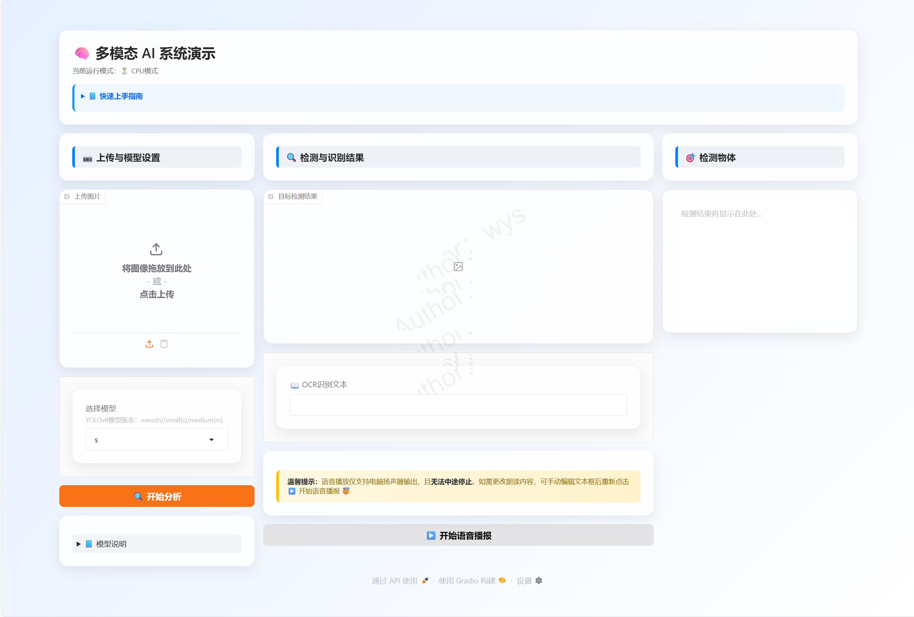

# 🧠 多模态AI系统

[](https://opensource.org/licenses/MIT)
[](https://www.python.org/downloads/)

结合OCR文字识别、YOLOv8目标检测和TTS语音播报的多模态AI系统，提供直观的Gradio交互界面。

 <!-- 稍后添加实际截图 -->

## ✨ 功能特性
- **OCR文字识别**：支持中英文混合识别
- **目标检测**：YOLOv8模型（nano/small/medium可选）
- **语音播报**：TTS语音输出
- **响应式UI**：基于Gradio的直观界面
- **跨平台支持**：自动适配CPU/GPU环境

## ⚙️ 安装指南

### 环境要求
- Python 3.12(其它版本未测试)
- NVIDIA GPU（可选，推荐用于加速）

### 安装步骤
```bash
# 克隆仓库
git clone https://github.com/wuyusen666/multimodal-ai-system.git
cd multimodal-ai-system

# 创建虚拟环境（推荐）
python -m venv venv
source venv/bin/activate  # Linux/Mac
venv\Scripts\activate    # Windows

# 安装依赖
pip install -r requirements.txt
```

## 🚀 使用说明
```bash
python main.py
```
启动后访问 `http://localhost:7860` 打开交互界面

### 操作流程：
1. 📷 上传图片或使用剪贴板
2. 🔧 选择YOLOv8模型（n/s/m）
3. 🔍 点击"开始分析"按钮
4. 📖 查看OCR文本和检测结果
5. ▶️ 点击"开始语音播报"收听识别内容

## 🧩 项目结构
```plaintext
src/
├── detection_module.py  # 目标检测模块
├── logger.py            # 日志系统
├── ocr_module.py        # OCR识别模块
└── tts_module.py        # 语音播报模块
main.py                  # 主程序入口
requirements.txt         # 依赖清单
style.css                # 界面样式
yolov8m.pt               # 模型文件
yolov8n.pt               # 模型文件
yolov8s.pt               # 模型文件
```

## 📜 开源协议
本项目采用 [MIT License](LICENSE) 授权